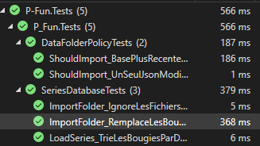

# Rapport de Projet — P-Fun


| | |
|---|---|
| **Projet** | P-Fun |
| **Auteur** | Damien Rochat |
| **Date de rendu** | *24 août 2026 / 30 octobre 2026* |
| **Encadrant** | *M. Carrel* |

---

## Table des matières


1. [Introduction](#1-introduction)
   - 1.1 [Objectifs du projet](#11-objectifs-du-projet)
   - 1.2 [Description du domaine](#12-description-du-domaine)
2. [Analyse fonctionnelle](#2-analyse-fonctionnelle)
3. [Planification initiale](#3-planification-initiale)
4. [Rapport de tests](#4-rapport-de-tests)
5. [Usage de l'intelligence artificielle dans le projet](#5-usage-de-lintelligence-artificielle-dans-le-projet)
6. [Bilan du déroulement du projet](#6-bilan-du-déroulement-du-projet)
7. [Bilan produit](#7-bilan-produit)
8. [Conclusion](#8-conclusion)

---

## 1. Introduction

### 1.1 Objectifs du projet

#### Objectifs produit

Le but du projet est de créer un logiciel qui affiche des graphiques de séries temporelles. Concrètement, le programme doit permettre :

- d'afficher plusieurs séries en même temps sur un même graphique, pour pouvoir les comparer ;
- de stocker les données en local au format JSON, pour pouvoir les consulter sans connexion ;
- d'importer de nouvelles données (fichiers CSV, fichiers JSON ou API Binance) ;
- de zoomer, de naviguer dans le temps et de choisir les séries à afficher ou masquer.

On a choisi le domaine de la cryptomonnaie. Par exemple, on pourra comparer l'évolution du Bitcoin et de l'Ethereum sur la même période et voir laquelle a le mieux performé.

#### Objectifs pédagogiques

Le projet doit me faire pratiquer ce qu'on a vu au module 323 :

- utiliser LINQ au lieu des boucles for/foreach classiques ;
- écrire au moins deux extensions du langage C# ;
- approfondir le C# (API REST, JSON, interface graphique WinForms) ;
- découvrir la librairie ScottPlot pour les graphiques ;
- suivre une démarche de projet complète : user stories, maquettes, planification, tests unitaires et journal de travail.

### 1.2 Description du domaine

#### Le domaine d'application

On a choisi la cryptomonnaie et la finance en général. C'est un domaine qui produit beaucoup de données : les marchés sont ouverts 24h/24, 7j/7, et les prix changent en permanence. C'est donc adapté pour des séries temporelles.

Comparer plusieurs cryptomonnaies sur un même graphique est utile pour voir :

- quelles monnaies ont le mieux performé sur une période donnée ;
- si les monnaies évoluent de la même façon (le Bitcoin et l'Ethereum bougent souvent ensemble) ou au contraire se démarquent ;
- lesquelles sont plus volatiles que d'autres.

#### Les séries de données choisies

Le cahier des charges demande au moins 5 séries cohérentes de 500 valeurs minimum. On a pris 5 paires de cryptomonnaies, toutes cotées contre l'USDT (un stablecoin qui vaut environ 1 dollar) :

| Série | Description |
|:---|:---|
| BTC/USDT | Bitcoin, la référence du marché |
| ETH/USDT | Ethereum, la deuxième plus grosse capitalisation |
| BNB/USDT | La monnaie de la plateforme Binance |
| SOL/USDT | Solana, une alternative plus récente |
| XRP/USDT | Ripple, orienté paiements |

Ces séries sont cohérentes entre elles parce qu'elles sont toutes comparées au même actif (l'USDT). On peut donc les afficher sur le même graphique et les comparer directement, sans conversion. Chaque série contient largement plus de 500 valeurs (par exemple les cours quotidiens sur plusieurs années).

#### Les sources de données

Les données viennent de l'API publique de Binance (`https://api.binance.com`). On utilise le endpoint des klines (chandeliers), qui renvoie pour une paire donnée l'historique des prix : ouverture, clôture, plus haut, plus bas et volume, pour un intervalle choisi (1h, 1 jour, etc.). Cette API est gratuite et ne demande pas d'inscription pour les données publiques. Elle renvoie du JSON.

Les données récupérées sont ensuite enregistrées en local au format JSON. Comme ça, on peut les consulter hors ligne et en importer d'autres depuis des fichiers CSV ou JSON.


---

## 2. Analyse fonctionnelle

### 2.1 User stories

Les user stories ont été rédigées au début du projet, avant le code, comme demandé dans le cahier des charges. Elles sont suivies sur le projet Kanban GitHub et dans les issues du repo.

| ID | User story | Priorité |
|:---|:---|:---:|
| US1 | Affichage des 5 séries au lancement de l'application | Haute |
| US2 | Choix des séries affichées ou masquées | Haute |
| US3 | Stockage local des séries, travail hors connexion | Haute |
| US4 | Import de données (CSV, JSON, API) | Haute |
| US5 | Flexibilité d'affichage pour analyser les données | Moyenne |

#### US1 – Affichage

> En tant qu'utilisateur, je veux que quand je lance l'application, une fenêtre s'ouvre avec les 5 séries, afin de visualiser rapidement le cours des cryptomonnaies.

**Scénario 1 : Affichage des 5 séries principales au lancement**
```
Étant donné que l'application est installée
Quand je lance l'application
Alors une fenêtre principale doit s'ouvrir immédiatement
Et la fenêtre doit afficher exactement 5 séries de données
Et chaque série doit présenter des données différentes
```

#### US2 – Sélection des séries

> En tant qu'utilisateur, je veux pouvoir déterminer quelle série est affichée ou pas, afin de comparer les différences.

**Scénario 1 : Sélection/désélection d'une série spécifique**
```
Étant donné que je suis sur la fenêtre de comparaison avec les 5 séries affichées
Quand je décoche la case de masquage de la série "Bitcoin"
Alors la courbe/série "Bitcoin" doit disparaître du graphique
Et l'échelle du graphique doit s'adapter automatiquement aux séries restantes
Et les 4 autres séries doivent rester visibles
```

#### US3 – Stockage local

> En tant qu'utilisateur, je veux que PTL stocke localement l'ensemble des séries, pour que je puisse travailler sur mes données hors connexion.

**Scénario 1 : Persistance et consultation des séries en mode hors connexion**
```
Étant donné que l'application PTL a synchronisé et stocké l'ensemble des séries localement lors de la dernière connexion
Et que l'appareil est actuellement hors ligne (pas d'accès au réseau)
Quand je lance l'application et accède au module de visualisation
Alors l'ensemble des séries enregistrées doit s'afficher correctement sur l'interface
Et je dois pouvoir consulter, filtrer et comparer les données sans interruption ni message d'erreur réseau
Et un indicateur discret doit informer que les données affichées proviennent du cache local
```

#### US4 – Importation

> En tant qu'utilisateur, je veux ajouter des valeurs aux séries stockées localement. PTL me permet d'importer un ou plusieurs formats de données, comme par exemple : fichiers CSV, fichiers JSON, JSON reçu d'une API.

**Scénario 1 : Importation réussie d'un fichier CSV ou JSON local**
```
Étant donné que l'application PTL est ouverte
Quand j'importe un fichier local valide (format .csv ou .json) contenant de nouvelles valeurs pour une série
Alors les données doivent être analysées et intégrées dans le stockage local
Et la série concernée doit être automatiquement mise à jour dans l'interface graphique
Et un message de confirmation doit indiquer le nombre de points ajoutés
```

#### US5 – Flexibilité d'affichage

> En tant qu'utilisateur, je veux avoir une grande flexibilité d'affichage afin de pouvoir analyser mes données en détail.

### 2.2 Besoins fonctionnels

À partir des user stories, le logiciel doit permettre :

- d'afficher plusieurs séries de cryptomonnaies sur un même graphique (US1) ;
- de choisir les séries visibles ou masquées (US2) ;
- de stocker les données en local pour travailler hors connexion (US3) ;
- d'importer des données depuis des fichiers CSV, JSON ou une API (US4) ;
- de zoomer et naviguer dans les données (US5).

### 2.3 Besoins non-fonctionnels

- Performance : l'affichage doit rester fluide avec des séries de plus de 500 valeurs.
- Fiabilité : si l'API ne répond pas, l'application doit continuer à fonctionner avec les données locales.
- Utilisabilité : l'interface doit être simple à prendre en main.
- Maintenabilité : code organisé, commenté, avec des tests unitaires.

### 2.4 Contraintes techniques

- Utiliser LINQ (pas de boucle for)
- Implémenter au moins 2 extensions du langage C#
- Interface graphique en WinForms
- Graphiques avec ScottPlot
- Au minimum 3 tests unitaires significatifs

---

## 3. Planification initiale

### 3.1 Méthodologie

On travaille en agile, avec des sprints d'une semaine. À la fin de chaque sprint, on fait un point d'avancement et une petite démo. On utilise un tableau Kanban pour suivre les tâches (à faire, en cours, terminé). Tout le code est sur Git, avec une branche par fonctionnalité.

### 3.2 Planning prévisionnel

| Sprint | Période | Tâches | Livrable | Statut |
|:---:|:---|:---|:---|:---:|
| 0 | 24 août | Analyse du besoin, user stories, maquettes | CDC fonctionnel validé | ✅  |
| 1 | 31 août | Projet Git, structure C#, premier GUI WinForms | Fenêtre principale avec un graphique vide | ✅  |
| 2 | 7 septembre | Connexion à l'API Binance, parsing des données | Affichage des premières vraies données | ⬜  |
| 3 | 14 septembre | Stockage local JSON, import CSV/JSON | Persistance des données | ✅  |
| 4 | 21 septembre | Multi-séries, sélection des séries, zoom | Graphique multi-courbes interactif | ✅ |
| 5 | 28 septembre | Refactoring LINQ, extensions C# | Code conforme aux contraintes | 🟡 |
| 6 | 5 octobre | Tests unitaires (≥ 3), corrections de bugs | Rapport de tests | ✅ |
| 7 | 12 octobre | Finitions, UI, documentation | Version candidate | ⬜ |
| 8 | 19–30 octobre | Rapport final, bilan, release GitHub | Livraison finale | ⬜ |

> **Légende des statuts :**
> - ⬜ Non commencé
> - 🟡 En cours
> - ✅ Terminé
> - ❌ Bloqué

### 3.3 Estimation du temps

Le projet dure 24 périodes au total. Avec un sprint par semaine sur environ 9 semaines, ça fait environ 2 à 3 périodes par semaine, en plus du travail à la maison. On garde un peu de marge dans les sprints 7 et 8 pour les imprévus.

### 3.4 Risques

| Risque | Mesure |
|:---|:---|
| L'API Binance tombe ou change | Mettre les données en cache, prévoir des données fictives en secours |
| Retard sur un sprint | Revue hebdomadaire, réajustement des priorités, marge en fin de planning |
| Difficultés avec ScottPlot / WinForms | Se former au début du projet (sprint 1), documentation officielle |
| Perte de code ou de données | Push Git régulier, sauvegarde des JSON |


## 4. Rapport de tests

<!-- Stratégie de tests, résultats, couverture, bugs trouvés et corrigés -->

### 4.1 Stratégie de tests
Un test = une seule vérification. J'utilise xUnit dans un projet dédié (P-Fun.Tests). Mes noms de tests parlent d'eux-mêmes (ex: ImportFolder_IgnoreLesFichiersIllisibles ou ShouldImport_BasePlusRecenteQueTousLesJson_NeRelitRien), donc si un truc plante, je sais tout de suite quoi sans ouvrir le code.

Délier la logique de la UI. J'ai sorti toute la logique dans Core et Data. Rien à voir avec WinForms ou ScottPlot. Calculer une base 100 ou découper des données se fait à la volée sans ouvrir d'interface, ce qui rend les tests ultrarapides.

Zéro donnée réelle touchée. Les tests tournent dans des dossiers temporaires générés par GUID et nettoyés dans la foulée. Rien ne vient polluer ou casser data/ ni la prod.

Vrais fichiers plutôt que du mock. Au lieu de simuler avec des faux objets, le test écrit un petit JSON temporaire et laisse le vrai code d'importation le lire. Ça teste exactement la chaîne réelle.

Même style de code partout. Le projet est contraint ? Les tests aussi. Tout est écrit en LINQ sans boucles pour garder une cohérence globale.

La UI se vérifie à la main. Tester du WinForms ou du rendu graphique ScottPlot automatiquement, c'est souvent bancal et lourd. C'est le compromis : l'affichage se valide à l'œil.

### 4.2 Résultats des tests

Les tests passent tous.



### 4.3 Bugs identifiés et corrections

| Bug | Sévérité | Résolu ? |
|:---|:---:|:---:|
| Échelles de prix incomparables (BTC à 82 948 contre EUR à 1,14) | 🔴 Critique | ✅ |
| Le graphique saccadait au zoom | 🔴 Critique | ✅ |
| Le nouvel import n'écrasait pas les données déjà stockées | 🔴 Critique | ✅ |
| Le survol de la souris prenait 6 ms par mouvement | 🟠 Moyen | ✅ |
| Les trous de données étaient reliés par un trait | 🟠 Moyen | ✅ |
| Un fichier illisible disparaissait sans explication | 🟠 Moyen | ✅ |
| La couleur d'une série changeait quand on en masquait une autre | 🟢 Mineur | ✅ |

> **Légende des sévérités :**
> - 🟢 Mineur
> - 🟠 Moyen
> - 🔴 Critique
>
> **Légende des statuts :**
> - ❌ Non résolu
> - ✅ Résolu
---

## 5. Usage de l'intelligence artificielle dans le projet

| Utilisation | Modèle |
|:---|:---|
| Correction de l'orthographe du projet | Xiaomi MiMo-2.5 |
| Débogage | DeepSeek V4.1 Flash (High) |
| Partie performance du programme | Space Bunny Alpha (High) |
| Tests unitaires | DeepSeek V4.1 Flash (High) |

Tous les modèles ci-dessus tournent sur mon propre serveur de LLM : aucune donnée du projet n'a servi à entraîner un modèle tiers.

J'ai utilisé l'IA pour quatre choses : l'orthographe, le débogage, la performance et les tests. Le poste dont j'ai le plus besoin, c'est l'orthographe — je suis mauvais en français, je ne m'en sors pas avec les accords, et je fais des fautes même dans ce rapport. Je m'en sers donc comme correcteur, surtout en fin de session sur les fichiers entiers : commentaires de code, messages de commit, rapport. Je lui ai toujours demandé de corriger sans reformuler, parce qu'un rapport entièrement réécrit par une IA ne serait plus le mien.

Sur le code, elle a servi de deuxième avis. Quand j'étais bloqué, elle ne m'a pas donné la réponse.

Une limite que j'ai posée dès le début : les messages de commit ne doivent pas être écrits par l'IA. Si je ne sais pas expliquer un changement, c'est que je ne le comprends pas encore.

---

## 6. Bilan du déroulement du projet

### 6.1 Planning respecté ?

Actuellement (28.09.2026) la planification initaial n'est pas totalement respecter. Car il y a des étapes que je n'ai pas fait dans l'ordre que ma plannification le montrais.


### 6.2 Méthodologie

J'ai utiliser l'agilité avec scrum. Même pour un projet solo je trouve ça pas mal de farie la partie "debrif" au debut ca permet de voir ou j'en suis avant de me jeter betement dans le travaille.


### 6.3 Problèmes rencontrés

Le plus gros problème que j'ai rencontré c'est le fait que mes differantes séries, les valeurs étais vachement éloignées les une des autres.

---

## 7. Bilan produit

### 7.1 Prévu / réalisé

| Fonctionnalité | Prévue ? | Réalisée ? | Commentaire |
|:---|:---:|:---:|:---|
| Affichage de 5 séries sur un même graphique (US1) | Oui |  Oui | Les 5 séries du dossier `data/` sont tracées au lancement, sur un axe temporel. |
| Choix des séries affichées ou masquées (US2) | Oui |  Oui | Une case à cocher par série dans le panneau latéral. La couleur d'une série reste la même même si on en masque une autre. |
| Stockage local et travail hors connexion (US3) | Oui |  Oui | Pas en JSON comme prévu au départ, mais dans une base SQLite. |
| Import de données (US4) | Oui |  Partiel | Import de dossiers JSON uniquement. Le CSV n'a pas été fait. |
| Flexibilité d'affichage (US5) | Oui |  Oui | Zoom et déplacement natifs de ScottPlot, plus l'ajout du mode base 100 et d'une infobulle au survol. |

#### Fonctions ajoutées, non prévues initialement

Ces fonctions ne sont dans aucune user story. Elles sont nées des problèmes
rencontrés pendant le développement :

| Ajout | Raison |
|:---|:---|
| Mode « Comparer (base 100) » | Le problème principal du projet : sans cette case, une série à 82 948 USDT écrase une série à 1,14 USDT et le graphique devient illisible. Chaque série est ramenée à 100 au lieu d'être tracée dans son prix réel. |
| Découpage des courbes en blocs | Un trou de données ne doit pas être relié par un trait, qui laisserait croire à une évolution régulière là où il n'y a aucune bougie. Chaque bloc est donc dessiné séparément. |
| Infobulle au survol | Affiche le prix réel de la bougie, sa date et sa variation depuis le début de la série, même quand le graphique est en base 100. |
| Réimport automatique | Les fichiers JSON du dossier `data/` ne sont relus que s'ils sont plus récents que la base, pour ne pas relire 242 Mo de JSON à chaque lancement. |
| Avertissement sur les fichiers ignorés | Un fichier illisible est ignoré en silence : le graphique manquerait alors une série sans explication. Un message liste les fichiers en cause. |
| Compteur de bougies et taille de la base | Affichés dans le panneau latéral, pour savoir ce qui est réellement stocké. |


### 7.2 Contraintes techniques

| Contrainte | Respectée ? | Détail |
|:---|:---:|:---|
| LINQ, pas de boucle `for` | ✅ | Refactor fait en fin de projet : 7 boucles supprimées. Seul subsiste un `List.ForEach` sur l'écriture SQL, car LINQ n'exprime pas un effet de bord par élément  (commenté) |
| Au moins 2 extensions C# | ✅ | `PriceSeriesExtensions` (base 100, variation, libellé de légende) et `SeriesExtensions` (création d'une case à cocher). |
| WinForms | ✅ | Une fenêtre principale avec un panneau latéral et un panneau de graphique. |
| ScottPlot | ✅ | avec le type `SignalXY` choisi pour les gros volumes. |
| Au moins 3 tests unitaires | ✅ | 5 tests automatisés au total (`SeriesDatabaseTests`, `DataFolderPolicyTests`), tous au vert |

### 7.3 Ce qui n'a pas été fait

Par honnêteté vis-à-vis de ce qui était annoncé :

- **L'import CSV** (US4) n'a pas été développé, seul le format JSON l'a été.
- **L'application ne contacte pas l'API Binance** elle-même. Le téléchargement
  passe par un script Python à lancer séparément, ce qui veut dire qu'il faut
  ouvrir un terminal pour rafraîchir ses données.
- **Les tests de performance** et le test de l'infobulle ne sont pas encore
  écrits, alors que le code qui les concernée existe.

---

## 8. Conclusion

<!-- Synthèse du projet, compétences acquises, perspectives d'amélioration -->


---

